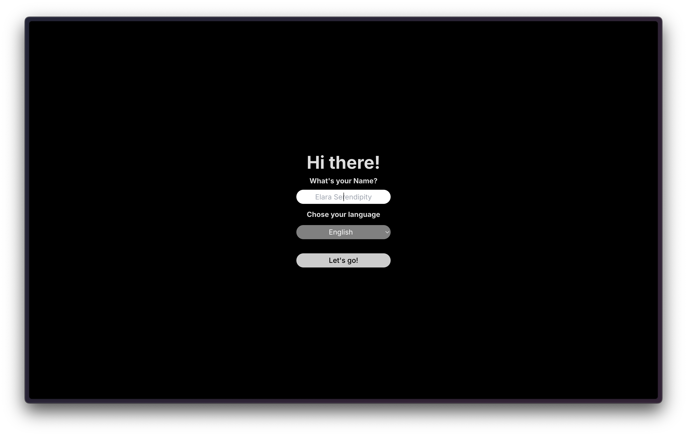
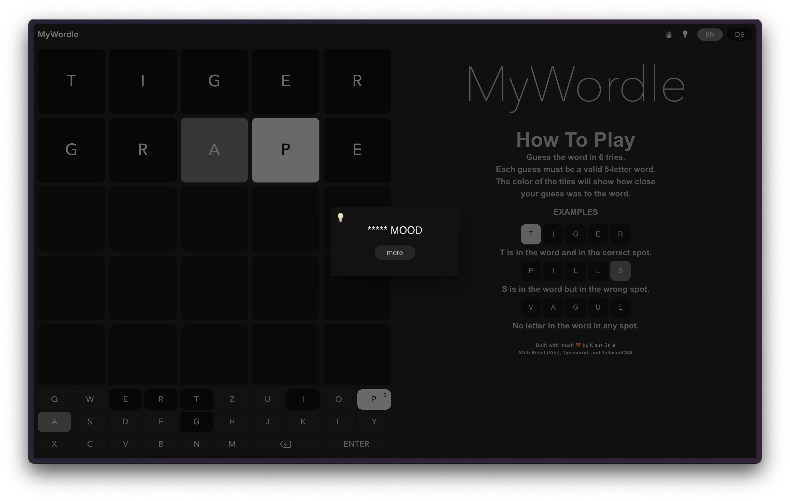
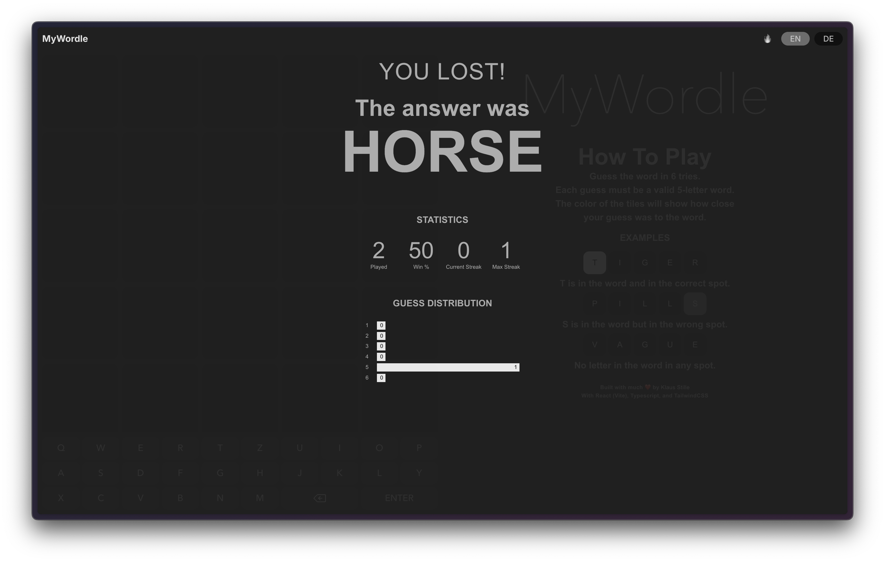
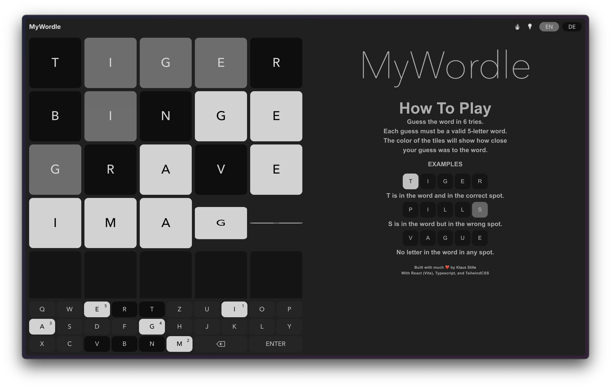
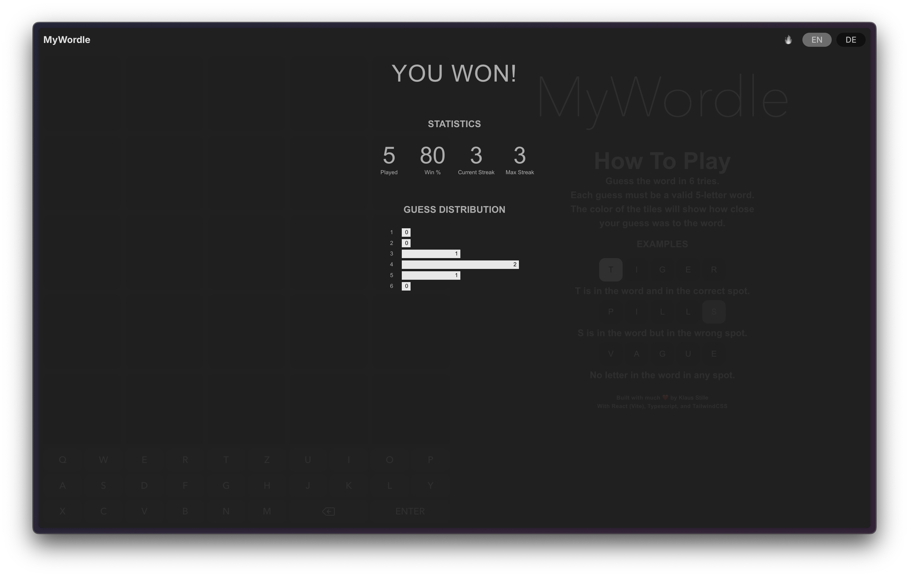

# Wordle App

This is a Wordle app inspired by the popular New York Times Wordle game. It allows users to guess a hidden word within a set number of attempts. Additionally, it provides statistics about the user's gameplay.

## Features

-   Guess Distribution/Statistics:
    -   Total number of games played
    -   Win percentage
    -   Current streak
    -   Maximum streak

## Technologies Used

-   **React (Vite)**: The frontend framework used to build the application.
-   **Typescript**: For type-checking and ensuring code integrity.
-   **TailwindCSS**: Used for styling the user interface with utility-first CSS classes.

## APIs Used

-   **Pons API**: Utilized for checking if a guessed word exists.
-   **Random Words API**: Used to fetch new words for the game.

## Supported Languages

The Wordle app supports two languages:

-   English (en)
-   German (de)
